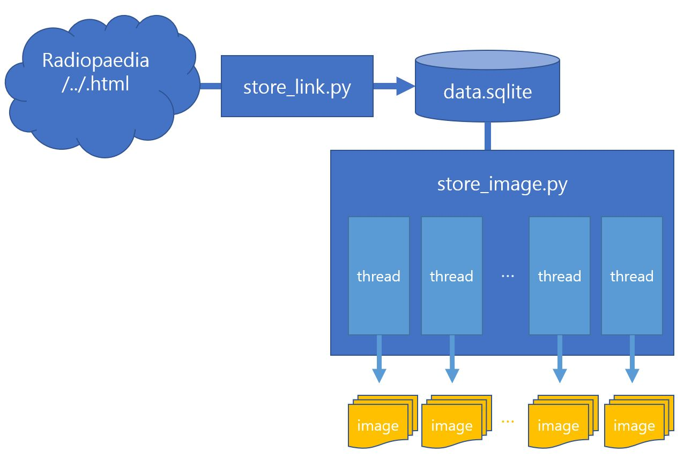

## image-download-crawler
교육 웹 리소스인 [Radiopaedia](https://radiopaedia.org/cases/)에서 image를 조건에 맞게 자동으로 다운 받을 수 있는 web crawler

    

### Guide
- store_link.py
    - 목록에 존재하는 CT&MRI tag를 가진 page의 url을 sqlite에 저장

- data.sqlite
    - store_link.py를 통해 생성되는 sqlite
    - url과 state(NO, ING, YES) 저장
        - state : 크롤링 완료 상태를 나타냄
    
- store_image.py
    - Tread로 분할하여 속도 향상
    - data.sqlite에서 크롤링 되지 않은 url에 대하여 크롤링 실행
    - 폴더를 세분화 하여 이미지 저장
      
### Functionality
- 아래 조건에 맞는 사진을 로컬저장소에 저장 
    - Lable : CT & MRI
    - File name : Axial
 
### Requirements
- Fast network speed
- Python 3.5
- BeautifulSoup
    - url을 빠르게 크롤링 하기위해 사용
- Selenium
    - 웹앱을 테스트하는 framework
    - webdriver api를 통해 운영체제에 설치된 chrome 등의 브라우저를 제어
    - js로 렌더링이 완료된 후의 dom 결과물에 대해 접근이 가능
- sqlite3
